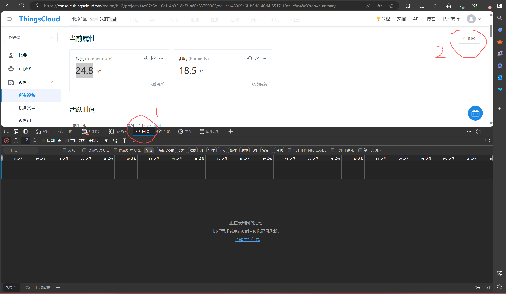
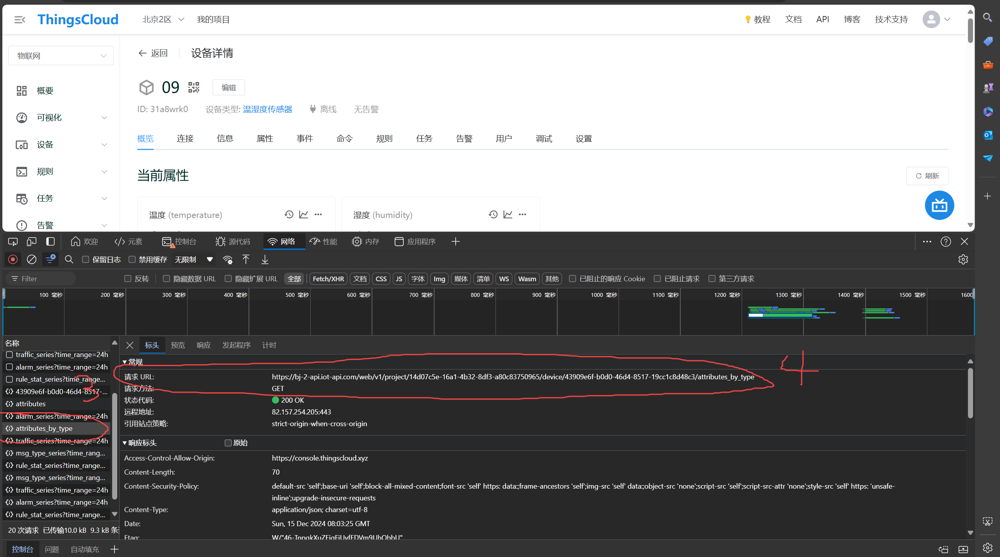

### 这是为了解决a9和rfid实验数据互联的朋友们准备的爬虫应用
#### --可以直接在实验电脑上运行
#### 输入（config.txt）：
这里面有三行，分别是url，邮箱和密码。邮箱和密码输入自己的就好，然后url使用图片里面的:
   

首先使用f12进入network界面，然后点击右上角的刷新

刷新之后可以看到左边有一个attributes_by_type的响应，点击它后右边的url就是我们要在config中填的url地址

#### 输出（a9.txt）：
然后点击运行exe文件，成功运行的话会出现一个a9.txt的文件，里面有两行，第一行是温度，第二行是湿度

#### 与java的联动：
直接在java中运行这个exe，并读取本地结果文件就行，详细见以下网址：https://blog.51cto.com/u_16213383/11247112